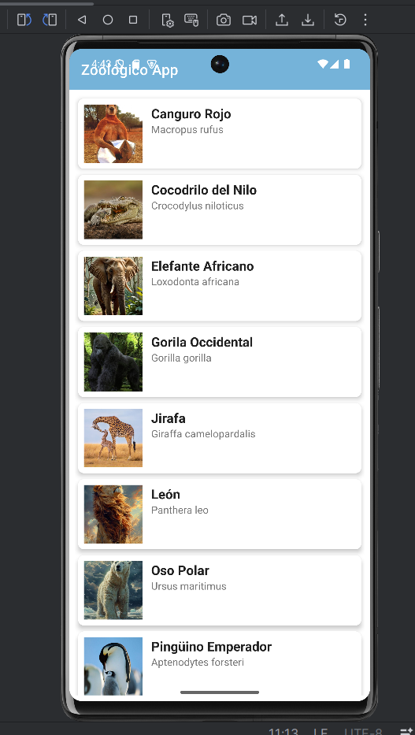
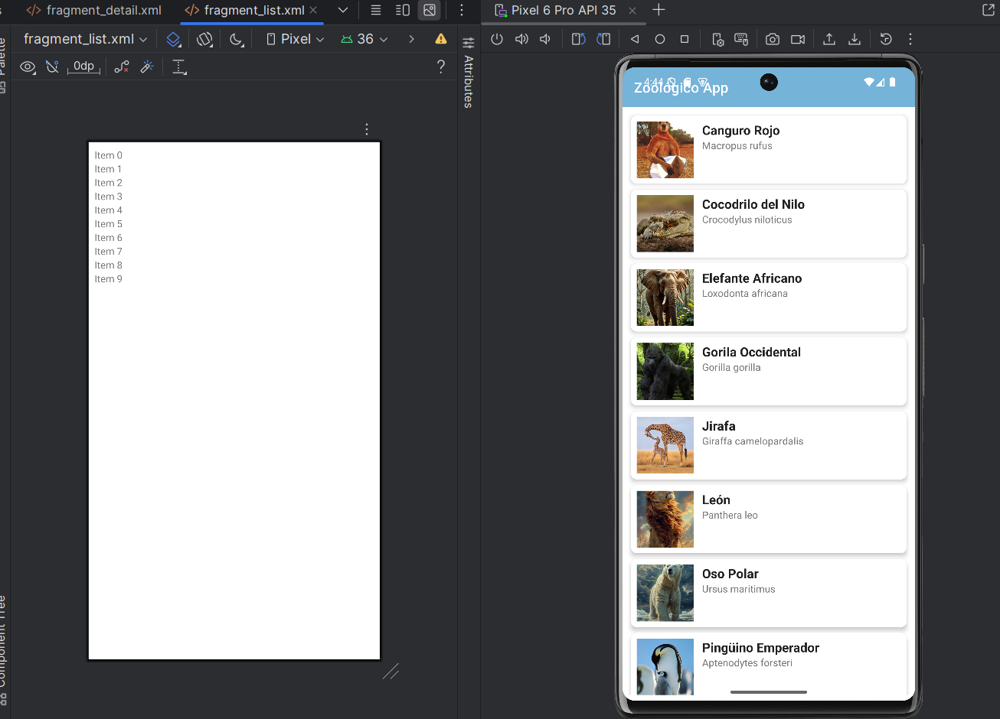
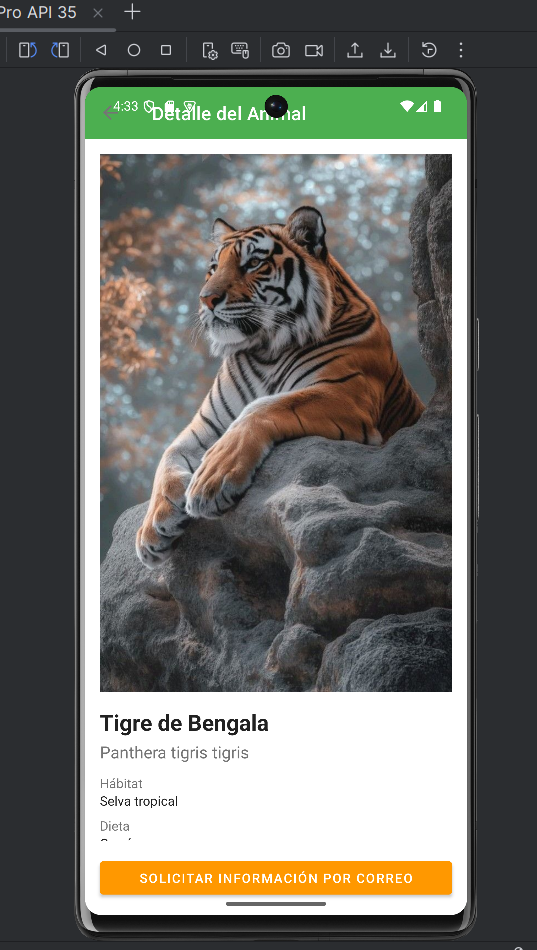
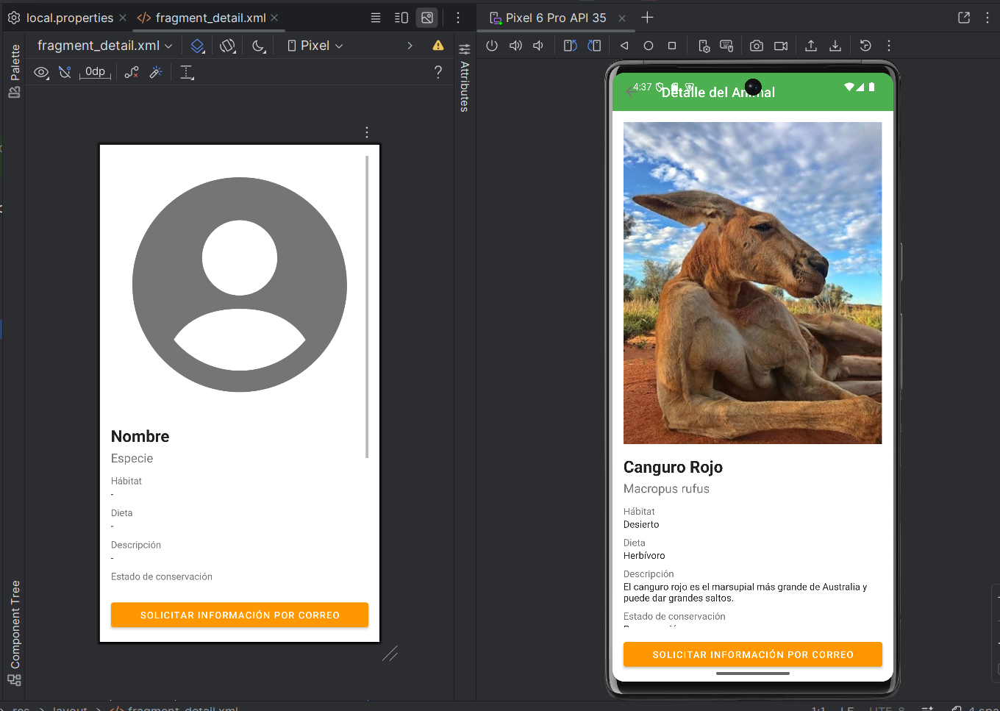

# 🐾 ZooApp – Aplicación Android

### 📚 Módulo 6 – Desarrollo de Aplicaciones Móviles

---

## 🌟 Descripción

**ZooApp** es una aplicación Android desarrollada en **Kotlin** que consume una API pública para mostrar información de distintos animales.

Permite explorar un listado y acceder al detalle de cada animal, mostrando datos como su hábitat, dieta y características principales.

Este proyecto fue desarrollado como parte del aprendizaje en consumo de APIs, arquitectura de aplicaciones móviles y manejo de datos.

---

## 🚀 Funcionalidades principales

* 📋 Visualización de listado de animales
* 🔍 Detalle completo por cada animal
* 🌐 Consumo de API REST
* 💾 Persistencia de datos con Room
* 🔄 Actualización de información desde la API

---

## 🛠️ Tecnologías utilizadas

* Kotlin
* Android Studio
* Retrofit (consumo de API)
* Room (base de datos local)
* Glide (carga de imágenes)
* Navigation Component

---

## 🔗 API utilizada

https://zoo-api.vercel.app/

---

## 📥 Cómo obtener el proyecto

### 🔹 Opción 1: Descargar ZIP

1. Ir al repositorio en GitHub
2. Hacer clic en **Code**
3. Seleccionar **Download ZIP**
4. Descomprimir el archivo en tu computador
5. Abrir la carpeta en Android Studio

---

### 🔹 Opción 2: Clonar con Git

```bash
git clone https://github.com/Danny3431/evaluacion-M6-ZooApp.git
```

Luego:

1. Abrir Android Studio
2. Seleccionar **Open**
3. Buscar la carpeta del proyecto
4. Esperar que Gradle sincronice automáticamente

---

## ⚙️ Cómo ejecutar la aplicación

1. Abrir el proyecto en Android Studio
2. Esperar la sincronización de Gradle
3. Ejecutar en:

   * 📱 Emulador
   * 📲 Dispositivo físico

---

## 📸 Evidencia de funcionamiento

### 📋 Lista de animales




📋Detalle del Fragmrnto Lista de animales




### 🔍 Detalle del animal




🔍 Detalle del Fragmento del animal




---

## 🧪 Estado del proyecto

✔ Aplicación funcional
✔ Consumo de API operativo
✔ Navegación entre pantallas correcta
✔ Persistencia de datos implementada

---

## 📚 Contexto académico

Este proyecto forma parte del:

**Módulo 6 – Desarrollo de Aplicaciones Móviles**

Donde se trabajan conceptos como:

* Consumo de APIs
* Arquitectura de aplicaciones
* Persistencia de datos
* Experiencia de usuario

---

## 👩‍💻 Autor

**Daniela Puebla M.**
